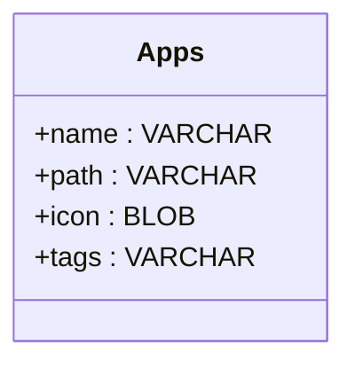

# 📦 app-UI

### *A customizable catalog to organize, display, and launch all your applications.*

**app-UI** is a Python application designed to create a **custom,
persistent catalog of software**.
It provides a clean graphical interface to browse, manage, and launch
programs, using an SQLite database, automatic icon management, and
user-editable settings.

------------------------------------------------------------------------

## ✨ Features

-   **Application catalog**
    Add applications with a name, executable path, icon, and more.

-   **Persistent SQLite database**
    `apps.db` stores all entries and is managed via `appDB.py`.

-   **Automatic icon loading**
    `IconLoader.py` extracts, loads, or generates icons to ensure
    consistent visuals.

-   **Graphical user interface**
    `appUI.py` provides an organized UI to browse and launch apps.

-   **User settings system**
    Managed by `settings.py`, persistent config in `settings.set`.

-   **Clean modular architecture**
    UI / database / icons / settings are separated into manageable
    modules.

------------------------------------------------------------------------

## 🗂️ Project Structure

    app-UI/
    │
    ├── appUI.py                 # Main user interface
    ├── appDB.py                 # SQLite database logic
    ├── appDetails.py            # Features
    ├── IconLoader.py            # Icon handling and processing
    ├── settings.py              # Settings manager
    │
    ├── apps.db                  # Application catalog database
    ├── settings.set             # Persistent user settings
    │
    └── README.md                # Project documentation

------------------------------------------------------------------------

## 🗄️ Database System

The database `apps.db` contains all cataloged applications.
`appDB.py` manages:

-   Database creation and initialization
-   Adding and removing applications
-   Editing entries
-   Performing queries
-   Ensuring data persistence

SQLite ensures a light, portable, and reliable data format.

------------------------------------------------------------------------

## 🎨 Icon Management

`IconLoader.py` handles all logic related to icons:

-   Loading icons from files
-   Extracting icons from executables (if available)
-   Resizing or formatting icons
-   Providing fallback icons

This ensures a consistent and visually appealing display.

------------------------------------------------------------------------

## 👤 Author

Developed by **Logic Loïc**
